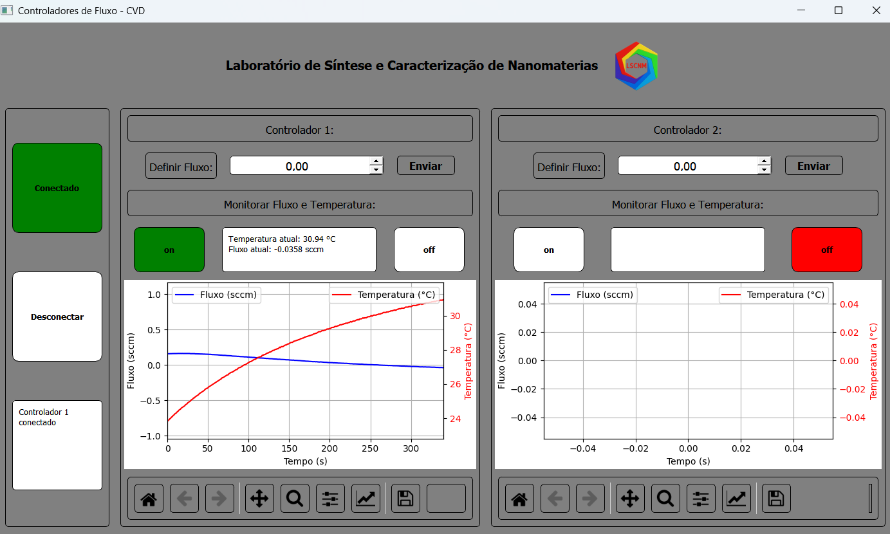

Controladores de Fluxo MKS – CVD (PyQt5 + ModbusTCP)

Aplicação de monitoramento e controle de fluxos e temperatura baseada em Python, desenvolvida para comunicação via ModbusTCP com controladores de fluxo digitais da marca MKS, utilizados em processos CVD (Chemical Vapor Deposition).
O projeto demonstra integração hardware-software, leitura/escrita de registradores Modbus, interface gráfica em PyQt5 e visualização em tempo real com Matplotlib.

A imagem abaixo demonstra o funcionamento da interface com apenas um controlador ativo. O software suporta dois controladores simultâneos via ModbusTCP, mas no momento da captura apenas um estava conectado.

⚙️ Funcionalidades

Conexão via ModbusTCP com controladores MKS (pyModbusTCP / pymodbus).

Leitura periódica de fluxo e temperatura (input registers).

Envio de setpoint em ponto flutuante (IEEE-754) dividido em dois registradores.

Interface gráfica em PyQt5 com gráficos em tempo real.

Modo --mock para execução sem hardware (simulação para testes).

🧰 Tecnologias

Python 3.10+ (recomenda-se 3.11)

PyQt5

pyModbusTCP / pymodbus

Matplotlib

Asyncio

🧩 Requisitos

Instale as dependências:

python -m venv venv
source venv/bin/activate   # Linux/Mac
venv\Scripts\activate      # Windows
pip install -r requirements.txt

🚀 Como executar

Modo simulado (sem hardware):

python controlador_cvd.py --mock

Modo com hardware (Modbus TCP):

Ajuste o IP do controlador MKS no topo do arquivo (192.168.2.155 por padrão), e execute:

python controlador_cvd.py

🗂️ Estrutura do repositório
controlador_cvd.py     # Arquivo principal (GUI + lógica Modbus)
requirements.txt        # Dependências do projeto
README.md               # Este arquivo

📚 Observações

O modo --mock permite simular leituras e testes sem necessidade de hardware físico.

A porta Modbus padrão é 502, podendo requerer privilégios de administrador.

Para integração com sistemas externos, é possível adicionar um módulo FastAPI que exponha endpoints REST para leitura/escrita de setpoints e logs.

👤 Autor

Juliany dos Santos Souza
📧 julianysantossouza@gmail.com
🔗 GitHub: Juliany-Souza
